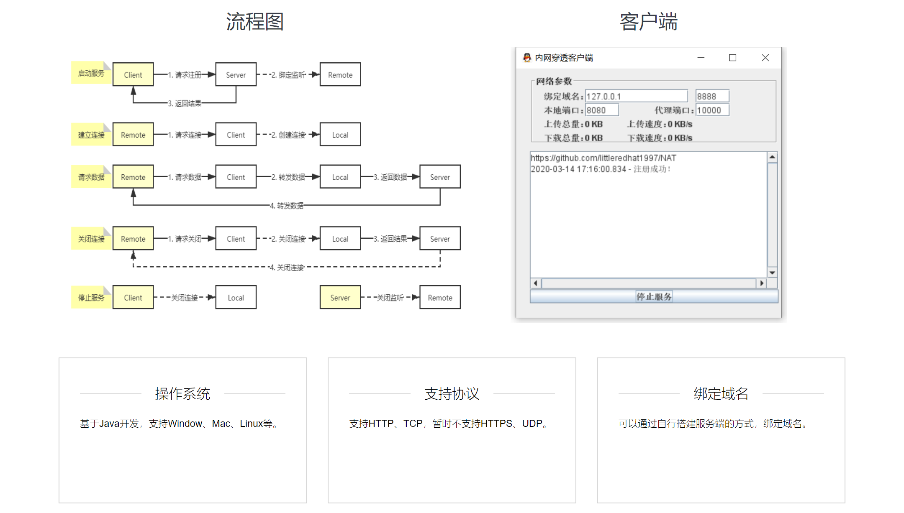

# 内网穿透



## 启动
1. java -jar nat-server.jar --port=8888
2. java -jar nat-client.jar

## 端口转发
1. 外网地址：http://www.littleredhat1997.com/
2. 内网地址：http://localhost/
3. http://www.littleredhat1997.com:10000/ <=> http://localhost:8080/

| 机器 | 标识 | 端口（默认） |
| :---: | :---: | :---: |
| 内网代理 | Local | 8080 |
| 客户端 | Client | - |
| 服务端 | Server | 8888 |
| 外网代理 | Remote | 10000 |

## 自定义协议
`消息体` = `消息体总长度` + `TYPE` + `length(CHANNEL_ID)` + `CHANNEL_ID` + `length(DATA)` + `DATA`
```
private MessageType type;
private String channelId;
private byte[] data;

UNKNOWN(0),
REGISTER(1),
REGISTER_SUCCESS(2),
REGISTER_FAILURE(3),
CONNECTED(4),
DISCONNECTED(5),
DATA(6),
KEEPALIVE(7);
```

## 拆包粘包 LengthFieldBasedFrameDecoder
参数：
1. maxFrameLength: 数据包的最大长度
2. lengthFieldOffset: 长度域的偏移量
3. lengthFieldLength: 长度域的字节数
4. lengthAdjustment: 长度域的偏移量矫正
5. initialBytesToStrip: 丢弃的起始字节数

示例：
```
new LengthFieldBasedFrameDecoder(Integer.MAX_VALUE, 0, 4, 0, 4)

public class MessageEncoder extends MessageToByteEncoder<Message> {
    @Override
    protected void encode(ChannelHandlerContext ctx, Message msg, ByteBuf out) throws Exception {
        // TODO
    }
}

public class MessageDecoder extends ByteToMessageDecoder {
    @Override
    protected void decode(ChannelHandlerContext ctx, ByteBuf msg, List<Object> out) throws Exception {
        // TODO
    }
}
```

## 心跳检测 IdleStateHandler
参数：
1. readerIdleTimeSeconds: 当在指定时间段内未执行任何读操作时触发
2. writerIdleTimeSeconds: 当在指定的时间内未执行任何写操作时触发
3. allIdleTimeSeconds: 当在指定的时间内未执行任何读或写操作时触发

示例：
```
new IdleStateHandler(60, 30, 0)

@Override
public void userEventTriggered(ChannelHandlerContext ctx, Object evt) throws Exception {
    if (evt instanceof IdleStateEvent) {
        IdleStateEvent e = (IdleStateEvent) evt;
        if (e.state() == IdleState.READER_IDLE) {
            // TODO
        } else if (e.state() == IdleState.WRITER_IDLE) {
            // TODO
        } else if (e.state() == IdleState.ALL_IDLE) {
            // TODO
        }
    }
}
```
