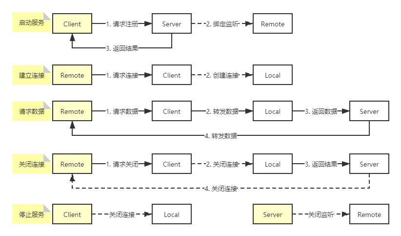

# NAT 内网穿透

1. 微信、支付宝支付
2. 小程序应用
3. 个人网站
4. ......

## 自定义协议
```
private MessageType type;
private String channelId;
private byte[] data;

UNKNOWN(0),
REGISTER(1),
REGISTER_RESULT(2),
CONNECTED(3),
DISCONNECTED(4),
DATA(5),
KEEPALIVE(6);
```
报文 = 报文总长度 + Type(4) + CHANNEL_ID_SIZE(4) + CHANNEL_ID + DATA_SIZE(4) + DATA

## 拆包粘包
LengthFieldBasedFrameDecoder

## 心跳检测
IdleStateHandler

## 转发流程
| 机器 | 标识 | 端口 |
| :---: | :---: | :---: |
| 内网服务 | service | 8080 |
| 客户端 | client | 随机 |
| 服务端 | server | 8888 |
| 代理服务 | proxy | 10000 |

外网地址：http://www.littleredhat1997.com/  
内网地址：http://localhost/  
http://localhost:8080/ <=> http://www.littleredhat1997.com:10000/

